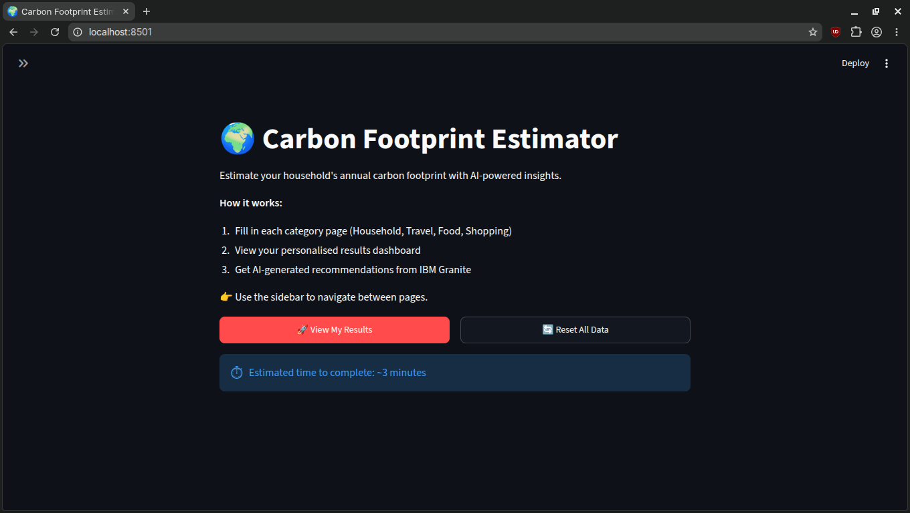
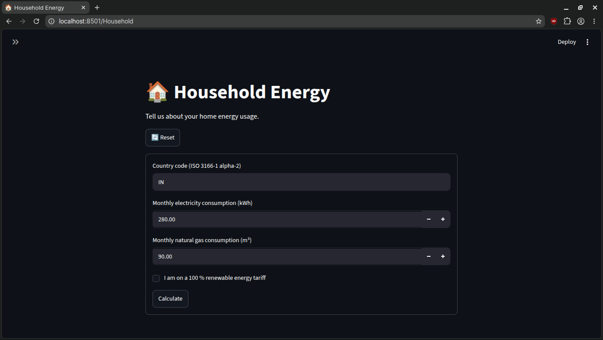
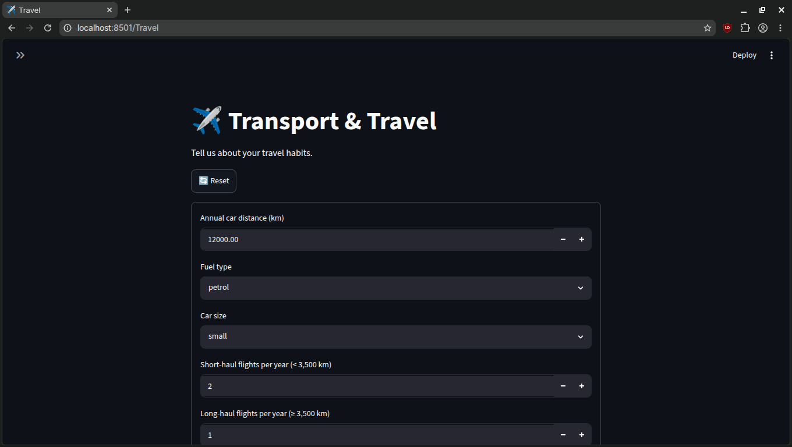
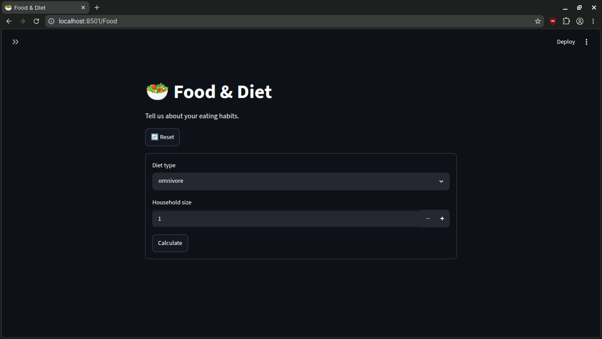
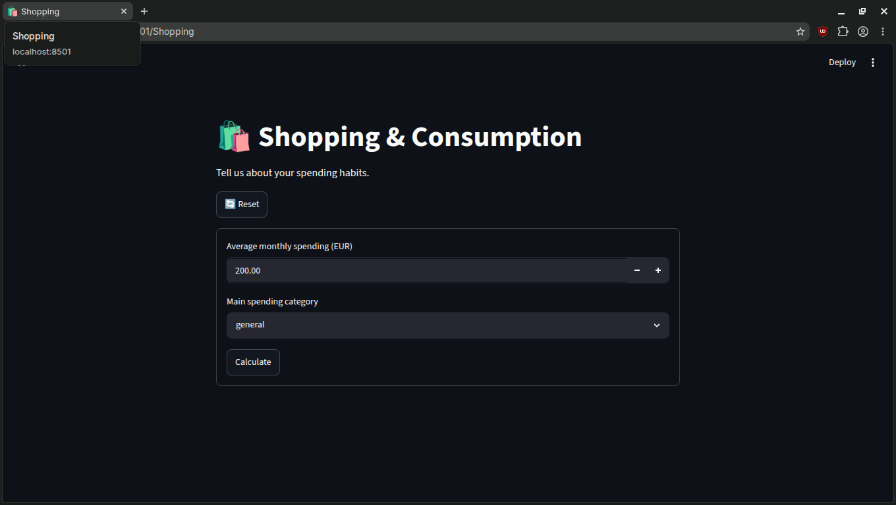
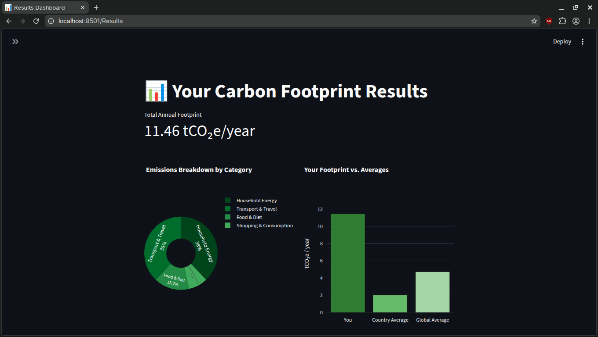

# 🌍 Carbon Footprint Estimator

> **Estimate your carbon footprint with AI-powered insights — built with Python, Streamlit, and Hugging Face serverless inference.**

[](https://www.python.org/)
[](https://streamlit.io/)
[](https://huggingface.co/)

---

## 📖 Table of Contents

1. [Project Overview](#-project-overview)
2. [Architecture & Workflow](#-architecture--workflow)
3. [Project Structure](#-project-structure)
4. [Installation & Running Locally](#-installation--running-locally)
5. [Configuration](#-configuration)
6. [Usage](#-usage)
7. [Emissions Methodology](#-emissions-methodology)
8. [Testing & Quality](#-testing--quality)
9. [Limitations & Roadmap](#-limitations--roadmap)

---

## 🌱 Project Overview

**Carbon Footprint Estimator** is an open-source web application that helps individuals and small households understand and reduce their environmental impact. Users enter information about their daily lifestyle — energy consumption, travel habits, diet, and shopping — and receive a personalised carbon footprint estimate along with AI-generated insights and actionable recommendations.

### Who Is It For?

| Audience        | Use Case                                                  |
| --------------- | --------------------------------------------------------- |
| **Individuals** | Understand personal emissions and identify quick wins     |
| **Households**  | Compare annual footprint against national/global averages |
| **Educators**   | Demonstrate climate concepts interactively                |
| **Developers**  | A reference project for Streamlit + LLM integration       |

### Key Features

- **Multi-scope estimation** — covers Household Energy, Transport & Travel, Food & Diet, and Shopping & Consumption.
- **Deterministic calculations** — emissions computed from well-defined emission factors (fully auditable, no black-box maths).
- **LLM-powered explanations** — Hugging Face serverless Inference API (default: `Qwen/Qwen2.5-7B-Instruct`) generates plain-language summaries, contextualises results, and suggests personalised reduction strategies.
- **Interactive visualisations** — breakdown charts per category, trend comparisons, and equivalency metrics (e.g., "equivalent to X trees/year").
- **Privacy-first** — all calculation logic runs locally; only anonymised result summaries are sent to the LLM.
- **Easy to extend** — emission factor tables are stored in plain YAML/JSON files, no database required.

> ⚠️ **Disclaimer:** All emissions figures are **estimates** based on publicly available average emission factors. They are intended for awareness and education, not for regulatory compliance or carbon-credit purposes.

---

## 🏗 Architecture & Workflow

```
┌──────────────────────────────────────────────────────────────────┐
│                         Streamlit Frontend                        │
│   [Input Forms]  →  [Validation]  →  [Results Dashboard]         │
└────────────┬───────────────────────────────────┬─────────────────┘
             │ raw user inputs                    │ display
             ▼                                    │
┌────────────────────────┐              ┌─────────┴────────────────┐
│  Emissions Calculator  │──estimates──▶│   Results Aggregator     │
│  (deterministic logic) │              │  (totals + charts data)   │
└────────────────────────┘              └─────────┬────────────────┘
                                                   │ structured summary
                                                   ▼
                                     ┌─────────────────────────────┐
                                     │  LLM (Hugging Face         │
                                     │  Serverless Inference API)  │
                                     │  · Plain-language summary   │
                                     │  · Contextual comparison    │
                                     │  · Personalised tips        │
                                     └─────────────────────────────┘
```

### What Is Deterministic vs. LLM-Assisted?

| Layer                            | Technology               | Responsibility                                                   |
| -------------------------------- | ------------------------ | ---------------------------------------------------------------- |
| **Input validation**             | Python / Pydantic        | Range checks, unit normalisation, missing value handling         |
| **Emissions calculation**        | Pure Python              | Multiply activity data × emission factors; fully reproducible    |
| **Visualisation**                | Plotly / Altair          | Category breakdowns, comparisons, equivalencies                  |
| **Natural-language summary**     | LLM via HF Inference API | Translate numbers into plain English; suggest next steps         |
| **Personalised recommendations** | LLM via HF Inference API | Context-aware tips based on the user's highest-impact categories |

> 🔒 The LLM **never** sees raw personal inputs. Only the aggregated per-category CO₂ totals and the chosen lifestyle context (e.g., country, household size) are included in the prompt.

---

## 📁 Project Structure

```
carbon-footprint-estimator/
│
├── app/                          # Core application package
│   ├── __init__.py
│   ├── calculator.py             # Deterministic emissions calculation logic
│   ├── validators.py             # Input schema & validation (Pydantic models)
│   ├── llm_client.py             # Hugging Face InferenceClient integration
│   ├── prompts.py                # Chat message templates for the LLM
│   └── visualisations.py        # Chart builders (Plotly/Altair)
│
├── data/                         # Emission factor reference data
│   ├── emission_factors.yaml     # Editable emission factors by category & region
│   └── country_averages.json     # Per-capita averages for contextual comparison
│
├── pages/                        # Streamlit multi-page app pages
│   ├── 1_🏠_Household.py         # Household energy input form
│   ├── 2_✈️_Travel.py            # Transport & travel input form
│   ├── 3_🥗_Food.py              # Food & diet input form
│   ├── 4_🛍️_Shopping.py          # Shopping & consumption input form
│   └── 5_📊_Results.py           # Results dashboard & AI insights
│
├── tests/                        # Automated tests
│   ├── test_calculator.py        # Unit tests for emissions logic
│   ├── test_validators.py        # Validation edge-case tests
│   └── test_llm_client.py        # Mocked LLM integration tests
│
├── docs/
│   └── images/                   # Application screenshots
│
├── .env.example                  # Example environment variables (no secrets)
├── .gitignore
├── main.py                       # Streamlit entry point
├── requirements.txt              # Python dependencies
├── pyproject.toml                # Project metadata & tool config
└── README.md                     # This file
```

### Key File Purposes

| File / Folder                | Purpose                                                                                            |
| ---------------------------- | -------------------------------------------------------------------------------------------------- |
| `main.py`                    | Streamlit entry point; renders the landing page and session state initialisation                   |
| `app/calculator.py`          | Houses all emission factor lookups and CO₂ arithmetic — no LLM calls here                          |
| `app/llm_client.py`          | Thin wrapper around the Hugging Face `InferenceClient`; uses `chat_completion` for chat-based LLMs |
| `app/prompts.py`             | Centralised message templates; keeps LLM instructions versioned and easy to audit                  |
| `data/emission_factors.yaml` | Single source of truth for emission coefficients; update here to change methodology                |
| `pages/`                     | One Streamlit page per estimation scope — keeps each form self-contained                           |
| `tests/`                     | `pytest`-based tests; calculator and validator tests run fully offline                             |

---

## 🚀 Installation & Running Locally

### Prerequisites

| Requirement          | Minimum Version                    |
| -------------------- | ---------------------------------- |
| Python               | 3.10+                              |
| pip                  | 23+ (or use `uv` / `poetry`)       |
| Hugging Face account | Free tier sufficient for inference |

### 1 — Clone the Repository

```bash
git clone https://github.com/<your-username>/carbon-footprint-estimator.git
cd carbon-footprint-estimator
```

### 2 — Create a Virtual Environment

```bash
python3 -m venv .venv
source .venv/bin/activate        # Linux / macOS
.venv\Scripts\activate           # Windows PowerShell
```

### 3 — Install Dependencies

```bash
pip install -r requirements.txt
```

<details>
<summary>Core dependencies (from <code>requirements.txt</code>)</summary>

```
streamlit>=1.35.0
huggingface-hub>=0.23.0
pydantic>=2.7.0
plotly>=5.22.0
altair>=5.3.0
pyyaml>=6.0.1
python-dotenv>=1.0.1
pytest>=8.2.0
pytest-mock>=3.14.0
```

</details>

### 4 — Configure Environment Variables

```bash
cp .env.example .env
# Then edit .env with your Hugging Face token (see Configuration section)
```

### 5 — Run the App

```bash
streamlit run main.py
```

The app will open at **http://localhost:8501** in your default browser.

---

## ⚙️ Configuration

### Environment Variables

Copy `.env.example` to `.env` and fill in your values. **Never commit `.env` to version control.**

```dotenv
# .env.example

# ------------------------------------------------------------------
# Hugging Face Configuration
# ------------------------------------------------------------------

# Your Hugging Face User Access Token (read-only scope is sufficient)
# Generate one at: https://huggingface.co/settings/tokens
HF_TOKEN=hf_xxxxxxxxxxxxxxxxxxxxxxxxxxxxxxxxxxxx

# Model identifier on Hugging Face Hub (must support chat_completion on serverless Inference API)
HF_MODEL_ID=Qwen/Qwen2.5-7B-Instruct

# ------------------------------------------------------------------
# Application Settings
# ------------------------------------------------------------------

# Default country for emission factor lookup (ISO 3166-1 alpha-2)
DEFAULT_COUNTRY=IN

# Maximum LLM output tokens for recommendations
LLM_MAX_NEW_TOKENS=512

# Set to "true" to show raw LLM prompt in the debug expander
DEBUG_PROMPTS=false
```

### Selecting the Model

The app uses the **Hugging Face `InferenceClient`** (chat_completion endpoint) to call any model available on the serverless Inference API. To switch models:

1. Find a model that supports `chat_completion` on the HF serverless API — for example `Qwen/Qwen2.5-7B-Instruct` (default) or `meta-llama/Meta-Llama-3-8B-Instruct` (requires accepting terms).
2. Update `HF_MODEL_ID` in your `.env` file with the full model identifier.
3. Restart the Streamlit server — no code changes required.

---

## 💻 Usage

### User Flow

```
1. Open app  →  Landing page shows scope overview + estimated time (~3 min)
2. Navigate to each category page and fill in the form fields
3. Hit "Calculate" on any page to see a partial result, or complete all pages
4. View the Results Dashboard — breakdown chart, total tCO₂e/year, country comparison
5. Click "Get AI Insights" — the LLM generates a personalised summary & tips
6. Download a PDF/CSV report (optional, if implemented)
```

### Example Input / Output

**Input — Household Energy (UK, 2-person flat)**

| Field                   | Value          |
| ----------------------- | -------------- |
| Country                 | United Kingdom |
| Electricity consumption | 280 kWh/month  |
| Natural gas consumption | 90 m³/month    |
| Renewable energy tariff | No             |

**Calculated Output**

```
Household Energy Emissions
  Electricity : 0.61 tCO₂e / year   (280 kWh × 0.233 kgCO₂/kWh × 12)
  Natural gas  : 2.03 tCO₂e / year  (90 m³  × 1.879 kgCO₂/m³  × 12)
  ─────────────────────────────────────────────────────
  Subtotal     : 2.64 tCO₂e / year
```

**LLM-Generated Insight**

> _"Your household energy use contributes 2.64 tonnes of CO₂ equivalent per year — about 18 % above the UK household average of 2.23 tCO₂e. Your gas heating is the biggest driver. Switching to a heat pump could cut this by up to 60 %. In the short term, lowering your thermostat by 1 °C typically reduces heating emissions by around 8 %."_

### Screenshots

| Page              | Screenshot                              |
| ----------------- | --------------------------------------- |
| Home              |            |
| Household Energy  |  |
| Travel            |        |
| Food              |            |
| Shopping          |    |
| Results Dashboard |       |

---

## 📊 Emissions Methodology

### Units

All emissions are expressed in **kilograms of CO₂ equivalent (kgCO₂e)**, then converted to **tonnes (tCO₂e)** for final display. The global warming potentials (GWPs) used follow the **IPCC AR6 100-year horizon** values.

### Calculation Approach

```
Activity Data  ×  Emission Factor  =  Emissions (kgCO₂e)

Example:
  300 kWh/month × 0.233 kgCO₂e/kWh × 12 months = 838.8 kgCO₂e/year
```

### Emission Factor Sources (Placeholders)

> ⚠️ The factors below are illustrative placeholders. Replace with verified, jurisdiction-specific data before deploying for policy or reporting purposes.

| Category                 | Factor Source (Placeholder)                                             |
| ------------------------ | ----------------------------------------------------------------------- |
| Grid electricity         | National grid average intensity (e.g., `[COUNTRY]_grid_intensity.yaml`) |
| Natural gas              | IPCC default combustion factors                                         |
| Petrol / diesel vehicles | DEFRA / EPA vehicle emission tables                                     |
| Flights                  | ICAO Carbon Emissions Calculator methodology                            |
| Food (by diet type)      | Poore & Nemecek (2018) lifecycle averages                               |
| Consumer goods           | Environmentally Extended Input-Output (EEIO) estimates                  |

### Updating Emission Factors

All factors live in `data/emission_factors.yaml`. Structure example:

```yaml
# data/emission_factors.yaml (excerpt)
electricity:
  GB:
    kgCO2e_per_kwh: 0.233 # Source: DESNZ 2024 provisional
    year: 2024
  IN:
    kgCO2e_per_kwh: 0.716 # Source: CEA Grid 2023
    year: 2023
  default:
    kgCO2e_per_kwh: 0.500 # Global average placeholder

transport:
  car_petrol_medium:
    kgCO2e_per_km: 0.192 # Source: DEFRA 2023
  short_haul_flight:
    kgCO2e_per_pkm: 0.255 # Source: ICAO placeholder
```

To add a new country or update a factor, edit the YAML file and restart the app — no code changes needed.

---

## 🧪 Testing & Quality

### Running Tests

```bash
# Run all tests
pytest tests/ -v

# Run with coverage report
pytest tests/ --cov=app --cov-report=term-missing
```

### What Is Tested

| Test File            | Coverage                                                                        |
| -------------------- | ------------------------------------------------------------------------------- |
| `test_calculator.py` | Known-good input → expected kgCO₂e output; edge cases (zero values, max values) |
| `test_validators.py` | Invalid input rejection; boundary values; unit conversion correctness           |
| `test_llm_client.py` | Mocked API responses; retry behaviour; prompt construction; error handling      |

### Example Unit Test

```python
# tests/test_calculator.py
from app.calculator import calculate_electricity_emissions

def test_electricity_uk_known_value():
    result = calculate_electricity_emissions(
        kwh_per_month=280, country="GB", months=12
    )
    assert abs(result - 782.88) < 1.0  # 280 × 0.233 × 12
```

### Linting & Formatting

```bash
pip install black ruff
black app/ tests/
ruff check app/ tests/
```

Tool configuration is in `pyproject.toml`:

```toml
[tool.ruff]
line-length = 88
select = ["E", "F", "I", "W", "UP", "B", "C4", "T20"]

[tool.black]
line-length = 88
target-version = ["py310"]
```

---

## ⚠️ Limitations & Roadmap

### Known Limitations

- **Estimates only** — emission factors are averages and vary significantly by region, season, and individual behaviour.
- **No real-time grid data** — electricity carbon intensity is based on annual averages, not live grid mix.
- **LLM latency** — Hugging Face serverless inference may be slow (~5–30 s) during peak periods; dedicated endpoints reduce this.
- **English only** — UI text and LLM prompts are currently English-only.
- **No user accounts** — results are session-based and not persisted across visits.
- **Scope 3 incomplete** — supply-chain emissions for goods and services are approximated using high-level IO models.

### Roadmap

| Priority  | Feature                                                                                                 |
| --------- | ------------------------------------------------------------------------------------------------------- |
| 🔴 High   | Add real-time electricity carbon intensity via [Electricity Maps API](https://www.electricitymaps.com/) |
| 🔴 High   | PDF/CSV result export                                                                                   |
| 🟡 Medium | Multi-language support (prompt localisation)                                                            |
| 🟡 Medium | Historical tracking — optional local SQLite storage                                                     |
| 🟡 Medium | Household comparison mode (multiple profiles)                                                           |
| 🟢 Low    | Public API endpoint for programmatic access                                                             |
| 🟢 Low    | Docker / `docker-compose` deployment recipe                                                             |
| 🟢 Low    | CI/CD pipeline with GitHub Actions                                                                      |

---

## 🙏 Acknowledgements

- [Hugging Face](https://huggingface.co/) — model hosting and serverless inference infrastructure.
- [Streamlit](https://streamlit.io/) — rapid Python web app framework.
- [Qwen (Alibaba Cloud)](https://huggingface.co/Qwen) — default chat model powering the AI insights layer.
- Emission factor methodology inspired by [DEFRA](https://www.gov.uk/government/collections/government-conversion-factors-for-company-reporting), [IPCC AR6](https://www.ipcc.ch/assessment-report/ar6/), and [ICAO](https://www.icao.int/environmental-protection/CarbonOffset/Pages/default.aspx).

---

<p align="center">
  Made with ❤️ and a small carbon footprint.
  <br/>
  <em>Every tonne saved counts.</em>
</p>
